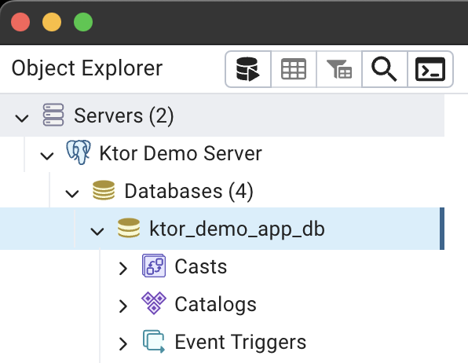

# Steps to Run - Ktor Demo App

## Ktor


## Clone the repository

```bash
git clone https://github.com/androiddevnotes/ktor-demo-app
```

Note: some installation instructions are for mac, for windows/linux please install accordindly.

## Postgres Setup

On Terminal

```
createdb ktor_demo_app_db
```


```
psql ktor_demo_app_db
```


```
CREATE USER useralpha WITH PASSWORD 'passwordalpha';
```

```
GRANT ALL PRIVILEGES ON DATABASE ktor_demo_app_db TO useralpha;
```


```
\q
```

## PgAdmin Setup

On Terminal

```
brew install --cask pgadmin4
```

Open PgAdmin

In the "Create - Server" dialog that appears, fill in the following information:

General tab:

- Name: Give your server a name (e.g., "Ktor Demo App")

Connection tab:

- Host name/address: localhost (if your PostgreSQL server is on the same machine)
- Port: 5432 (default PostgreSQL port)
- Maintenance database: postgres (default database)
- Username: useralpha (the user you created for your application)
- Password: passwordalpha (the password you set for useralpha)




## Environment Variables

Create a `.env` file in the project root with the following content:

```
DATABASE_URL=jdbc:postgresql://localhost:5432/ktor_demo_app_db
DATABASE_USER=useralpha
DATABASE_PASSWORD=passwordalpha
JWT_SECRET=your_jwt_secret
JWT_ISSUER=ktor-demo-app
JWT_AUDIENCE=ktor-demo-app-users
UPLOAD_DIR=/Users/ask/PROJECTS/KMP/ktor/ktor-demo-app/uploads
```

Replace the values with your actual configuration.

## Build the project

On Terminal

```
./gradlew -t build
```


## Run the project

On Terminal

```
./gradlew run
```


## View Postgres Data

On PgAdmin


Three dictionary entries are added automatically from [dictionary_entries.json](src/main/resources/dictionary_entries.json)

## Flyway

We are using Flyway to manage the database migrations.

The migrations are in the [db/migration](src/main/resources/db/migration) directory.

The naming convention is `V<version>__<description>.sql`.

The migrations are applied automatically when the project is run.

When you add a new column to a table, you need to add a new migration.

Create a new file in the [db/migration](src/main/resources/db/migration) directory with the new migration.

The content of the file should be the SQL statement to add the new column.

The filename should be the next version number.

Example:

```
V1__Create_initial_tables.sql
```

```
ALTER TABLE quotes ADD COLUMN tags TEXT;
```

## OpenAPI/Swagger

To generate the OpenAPI documentation, we use IntelliJ IDEA Ultimate Ktor plugin with the "Generate OpenAPI" action.


## Postman

### Collection

Use the OpenAPI documentation to generate the Postman collection and environment.

Import the documentation.yaml file in Postman to generate the collection


### Environment

Create new environment in Postman


environment variables:

```
baseUrl: http://localhost:8080
apiKey: your_api_key
bearerToken: your_bearer_token
```

To generate bearerToken,

register a new user:


Then login with new user:
Copy the bearerToken and add it to the environment variables.


Then get API Key:
Copy the API Key and add it to the environment variables.


## Make a request

If you get error:

```
{
    "status": 401,
    "message": "Authentication required",
    "code": "UNAUTHORIZED"
}
```


Ensure you have added API key or Bearer Token to the request whichever is required.


## Heroku

### Prerequisites

1. [Heroku CLI](https://devcenter.heroku.com/articles/heroku-cli) installed on your machine
2. A Heroku account
3. Git installed on your machine

### Procfile

Ensure that your `Procfile` is correctly configured and in the root directory of your project:

```
web: ./build/install/com.example.ktor-sample/bin/com.example.ktor-sample
```

Replace `com.example.ktor-sample` with your actual project name if different.

### Deployment

```
heroku login
```

```
heroku create ktor-demo-app
```


Go to heroku dashboard and add addons:


Choose essential plan (cheapest one)

On terminal:

```
heroku config:set JWT_SECRET=your_jwt_secret
heroku config:set JWT_ISSUER=your_jwt_issuer
heroku config:set JWT_AUDIENCE=your_jwt_audience
heroku config:set UPLOAD_DIR=/app/uploads
```


```
git add .
git commit -m "Prepare for Heroku deployment"
git push heroku main
```


To deploy again to live ... after making changes. Add, commit, push to heroku:


Your API is now live!

Go to your heroku url for example:

https://ktor-demo-app-56ada9af7cac.herokuapp.com/api/v1/quotes


The quotes routes currently are not protected by authentication. The dictionary routes are protected by API Key authentication.

## Git + Heroku

To automatically deploy to heroku from git, go to heroku dashboard, click on the app, go to "Deploy" tab, click on "Connect to GitHub", and connect to your repository.


## Debug Heroku Logs

```
heroku logs --tail --app ktor-demo-app
```


## Project Overview

This is a Ktor-based API application for managing quotes and a dictionary. The application provides CRUD operations for quotes and dictionary entries, user authentication, and API key management.

## API Routes

These are few. You can use Postman to test the other routes.

Here are some of the main API routes:

1. User Registration: POST /api/v1/register
2. User Login: POST /api/v1/login
3. Generate API Key: POST /api/v1/api-key
4. Get Quotes: GET /api/v1/quotes
5. Create Quote: POST /api/v1/quotes
6. Get Dictionary Entries: GET /api/v1/dictionary
7. Create Dictionary Entry: POST /api/v1/dictionary
8. Search Quotes: GET /api/v1/quotes/search
9. Search Dictionary: GET /api/v1/dictionary/search

## Technology Stack

- Backend Framework: Ktor
- Database: PostgreSQL
- ORM: Exposed
- Authentication: JWT and API Keys
- Database Migration: Flyway
- Serialization: Kotlinx Serialization
- Logging: SLF4J with Logback

## Development Workflow

1. Make changes to the code
2. Build the project: ./gradlew -t build
3. Run the application: ./gradlew run
4. For database schema changes, create a new migration in src/main/resources/db/migration/ (as discussed above with flyway)

## Documentation

- API documentation is generated using the IntelliJ IDEA Ultimate Ktor plugin with the "Generate OpenAPI" action.
- The OpenAPI documentation can be found at src/main/resources/openapi/documentation.yaml.
- Swagger UI is available at /swagger when the application is running.

## Troubleshooting

If you encounter any issues during setup or running the application, please check the following:

1. Ensure all environment variables are correctly set in the .env file
2. Check the application logs for any error messages
3. Verify that the database is running and accessible
4. Make sure you have the correct permissions for the upload directory

## Additional Resources

- Ktor Documentation: https://ktor.io/docs/
- Exposed Documentation: https://github.com/JetBrains/Exposed
- Flyway Documentation: https://flywaydb.org/documentation/
- PostgreSQL Documentation: https://www.postgresql.org/docs/


Done